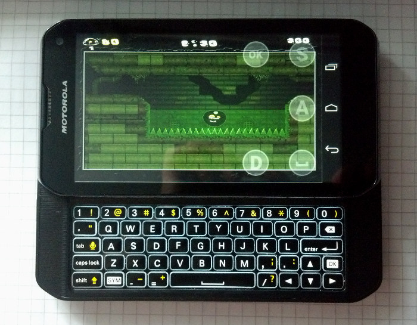
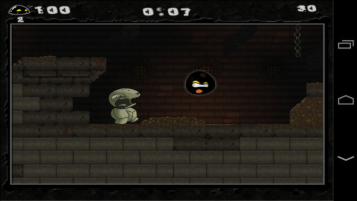
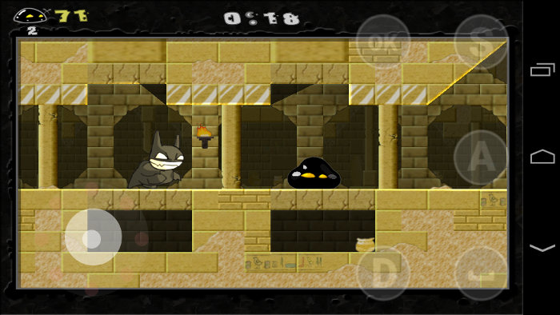
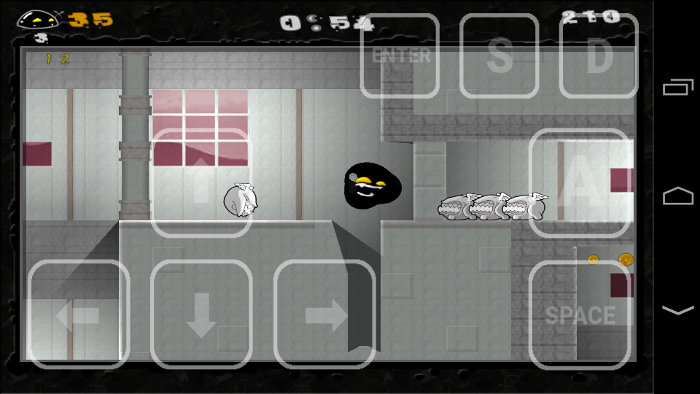

Gish
====

Gish is a side-scrolling platformer video game with some physics puzzle elements developed by Cryptic Sea (pseudonym of Alex Austin), Edmund McMillen, Josiah Pisciotta and published by Chronic Logic in 2004. The game was featured in the first Humble Indie Bundle in May 2010. Following the success of the Humble Bundle promotion, Cryptic Sea pledged to go open source with the game which eventually happened under the GPLv2 on May 29, 2010. - [Wikipedia](https://en.wikipedia.org/wiki/Gish_(video_game)).



This is my port Gish to Android OS with using SDL2, OpenAL and Ogg Vorbis libraries and rendering the videocontext of the game with using [GL4ES by ptitSeb](https://github.com/ptitSeb/gl4es) or OpenGL ES (thanks to the [Pickle](https://github.com/Pickle/GishGLES) for OpenGL ES renderer) libraries. I added touch controls developed by [SoD]Thor and some other improvements to the game engine.







[Gish port running on Motorola Photon Q, demonstration on YouTube](https://www.youtube.com/watch?v=GyMU2oV2LI4)

## Download

You can download APK-package for Android OS from the [releases](https://github.com/EXL/Gish/releases) section.

## Build instructions

> This tree has been updated to build against modern Android (AGP 8.5, Gradle 8.7,
> `targetSdk 34`, 64-bit ABIs, scoped storage). See [PORTING-NOTES.md](PORTING-NOTES.md)
> for everything that changed and what still needs verifying.

Requirements: JDK 17, the Android SDK with platform 34, and NDK `26.3.11579264`
(adjust `ndkVersion` in `gish/build.gradle` to use another one).

* Build the APK-package with the Gradle wrapper;

```sh
ANDROID_HOME="/opt/android-sdk/" ./gradlew assembleDebug
```

* Install the Gish APK-package on your Android device via adb;

```sh
/opt/android-sdk/platform-tools/adb install -r gish/build/outputs/apk/debug/gish-debug.apk
```

* Copy the purchased Gish game files onto the device, read some info [here](assets_full/ReadMe-GishData.md).
  On Android 11 and later, shared storage is no longer reachable by the engine, so
  use **Browse files… → Import from a ZIP archive…** in the launcher, or copy the
  files over USB into `Android/data/ru.exlmoto.gish/files/gishdata`;

* Run and enjoy!

You can also open this project in Android Studio IDE and build the APK-package by using this program.

## More information

Please read [Porting Guide (In Russian)](http://exlmoto.ru/gish-droid) for more info about porting Gish to Android OS.
